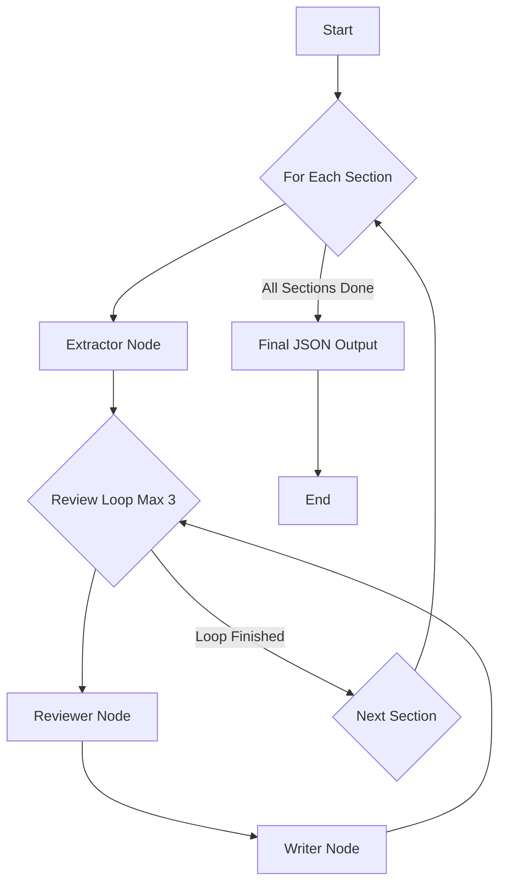

# Product Requirements Document: Portfolio Analysis Agent

## 1. Introduction

This document outlines the requirements for an AI agent designed to analyze portfolio company documents. The agent will ingest a collection of documents (PDFs, CSVs, etc.), extract key information into structured sections, and iteratively refine the content through a review and rewrite process. The final output will be a comprehensive analysis in a JSON format.

## 2. Objective

To automate the process of portfolio analysis by creating a structured, detailed, and referenced report from a collection of unstructured documents. This will enable faster and more consistent insights into company performance, risks, and strategic positioning.

## 3. Functional Requirements

### 3.1. Document Ingestion

*   The agent must be able to read all files from a specified input folder.
*   It must support various file formats, including but not limited to:
    *   PDF (.pdf)
    *   CSV (.csv)
    *   Word Documents (.docx)
    *   Text files (.txt, .md)
*   Documents should be loaded and their text content extracted for processing.

### 3.2. Core Agent Workflow

The agent will be implemented as a graph using LangGraph. The process will be cyclical for each section, with a defined number of refinement loops.



### 3.3. Agent Nodes

#### 3.3.1. Extractor Node

*   **Input:** A section title (e.g., "Financial Overview").
*   **Process:**
    1.  Performs an initial search/scan through all the ingested documents.
    2.  Extracts relevant information pertaining to the section title.
    3.  Generates an initial draft of the section content.
    4.  Identifies and records references (document name, page number) for the extracted information.
*   **Output:** A JSON object for the section with `content` and `references`.

#### 3.3.2. Reviewer Node

*   **Input:** The JSON object for a section from the Extractor or Writer node.
*   **Process:**
    1.  Analyzes the `content` of the section.
    2.  Generates a critique, which includes:
        *   What to expand upon.
        *   What to remove or rephrase.
        *   A list of search terms to find more detailed or missing information.
*   **Output:** A JSON object containing the critique.

#### 3.3.3. Writer Node

*   **Input:**
    1.  The original section JSON object.
    2.  The critique from the Reviewer Node.
*   **Process:**
    1.  Uses the suggested search terms from the critique to perform a more targeted search within the documents.
    2.  Rewrites the section `content` based on the critique and any new information found.
    3.  Updates the `references` if new sources are used.
*   **Output:** An updated JSON object for the section.

### 3.4. State Management

The graph will manage a state object that includes:

*   `documents`: The loaded content of all documents.
*   `sections_to_process`: A list of section titles to be analyzed (e.g., ["Overview", "Financial Review", "Risks"]).
*   `completed_sections`: A list of the final JSON objects for each processed section.
*   `current_section`: The section currently being processed.
*   `loop_count`: The current iteration of the review loop for the section.

### 3.5. Output

The final output of the agent will be a single JSON file containing a list of all the processed sections.

**Example JSON Output:**

```json
{
  "analysis": [
    {
      "section": "Overview",
      "content": "...",
      "references": [
        { "document": "annual_report_2023.pdf", "page": 5 },
        { "document": "investor_deck.pdf", "page": 2 }
      ]
    },
    {
      "section": "Financial Review",
      "content": "...",
      "references": [
        { "document": "financials_q4_2023.csv", "row": 10 }
      ]
    }
  ]
}
```
### 3.6. Search and Information Retrieval

The agent's ability to find relevant information is based on the following approach:

*   **Initial Broad Search**: The **Extractor Node** performs an initial, general search across all ingested documents to gather relevant information for a given section.
*   **Targeted Search via Refinement**: The **Reviewer Node** analyzes the extracted content and generates a list of specific "search terms" to find missing details or expand on certain points.
*   **Iterative Deep Dive**: The **Writer Node** uses these search terms to perform a more focused search, allowing the agent to iteratively home in on the most relevant information and refine the section content.
*   **Document Loading**: The underlying document loading mechanism supports `.txt`, `.csv`, and `.pdf` files. It extracts text-based content from these files to make it searchable.

## 4. Non-Functional Requirements

*   **Modularity:** Each node (Extractor, Reviewer, Writer) should be implemented as a separate, reusable component.
*   **Configurability:** The list of sections to analyze and the maximum number of review loops should be easily configurable.
*   **Extensibility:** The system should be designed to easily add new document parsers or new types of analysis nodes in the future.

## 5. Future Enhancements

*   **Natural Language Querying:** Allow users to ask questions about the generated report.
*   **Trend Analysis:** For financial data, perform trend analysis over time if multiple reports are provided.
*   **UI Integration:** Develop a simple cli which take s dir with the documents, and a csv list of sections to produce in the final report